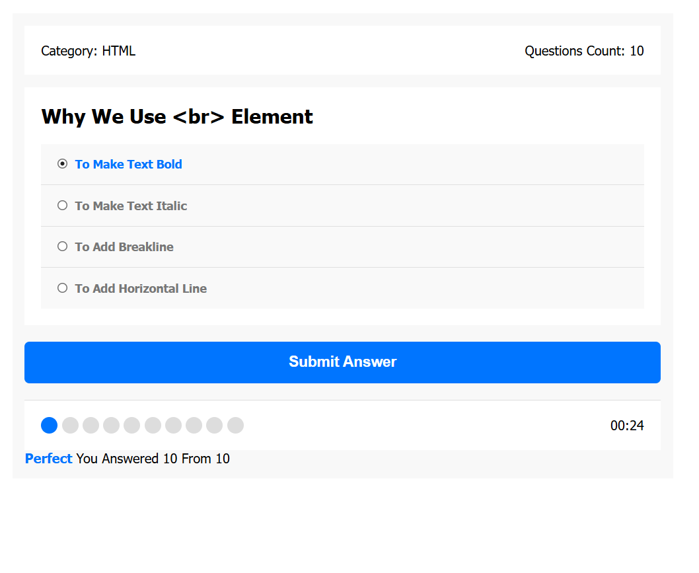
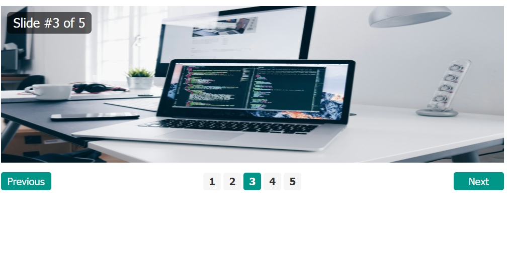
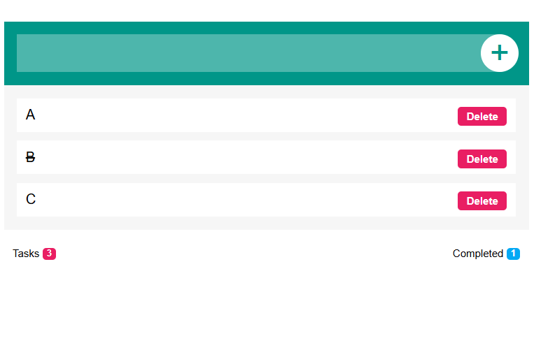
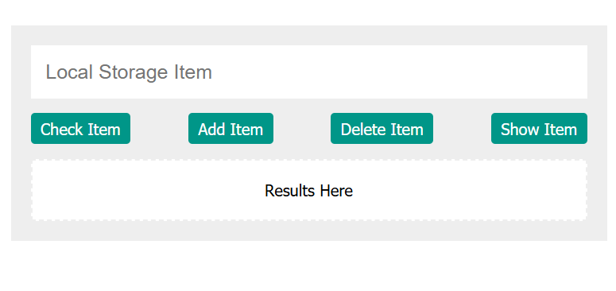
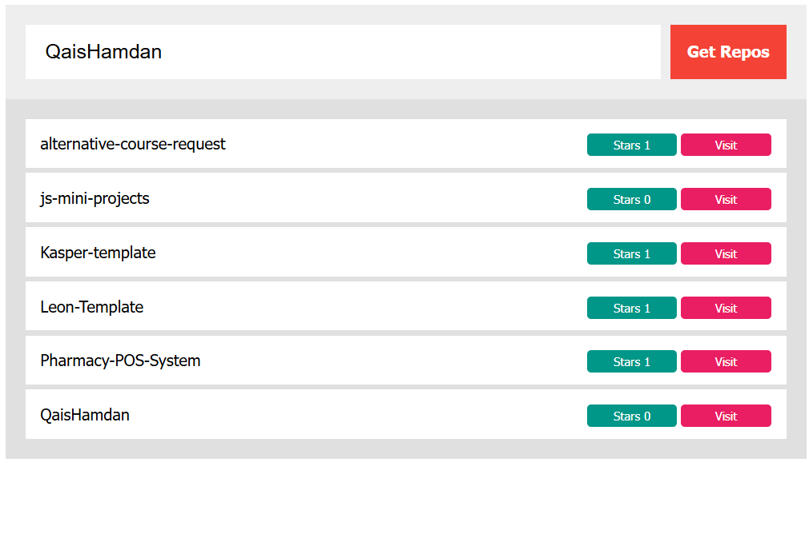

# JavaScript Mini Projects Collection

مجموعة من المشاريع المصغرة المطبقة بلغة JavaScript مع HTML و CSS.

---

## 1. Quiz Application
تطبيق اختبارات تفاعلي يجلب الأسئلة من ملف JSON خارجي مع عداد تنازلي.

---

## 2. JS Slider
سلايدر صور تفاعلي يتيح التنقل بين الصور باستخدام الأزرار أو النقاط (Indicators).

---

## 3. To-Do List App
تطبيق إدارة المهام اليومية يتيح إضافة وإعادة ترتيب وحذف المهام.

---

## 4. LocalStorage Control
تطبيق لتجربة والتحكم ببيانات المتصفح المحلي (LocalStorage).

---

## 5. GitHub Repositories Fetcher
تطبيق يجلب مستودعات أي مستخدم على GitHub باستخدام API.

